# ReadIO 项目

<div align="center">


**一款简约、易用、有品质、重原创的阅读工具与原创社区**

[项目文档](#文档) | [快速开始](#快速开始) | [项目结构](#项目结构) | [功能特性](#功能特性)

</div>

---

## 📖 项目简介

ReadIO 是一个集电子书阅读、二创社区、推荐系统于一体的综合性阅读平台。项目旨在为读者提供优质的阅读体验，同时构建一个围绕书籍的兴趣交流圈子，让有共同兴趣爱好的用户方便地交流、分享。

### 核心特点

- 📚 **多格式电子书阅读**：支持 EPUB、TXT、MOBI、PDF 等主流格式
- ✍️ **二创社区**：围绕原著衍生出的二创作品分享与交流
- 🎯 **智能推荐**：基于用户阅读记录的好句、好书推荐
- 🎨 **简约美观**：Material Design 设计，提供一致、美观的用户体验
- 🔐 **安全可靠**：完善的用户认证与权限管理系统

## 🎯 项目目标

### 基本目标

- ✅ 实现一款页面简约、兼容多种主流格式书籍的阅读器
- ✅ 实现一个具有可用性、业务功能完善的服务器后端
- ✅ 构建一个由原著衍生出的二创社区，允许用户上传作品或阅读他人作品

### 拓展目标

- ✅ 实现根据用户阅读记录的私人推荐、好句推荐功能
- ✅ 设计简洁美观、清晰明了、简单易用的页面
- ✅ 实现具有增删查改等基本功能的后台管理系统

## 🏗️ 项目结构

```
ReadIO/
├── Readio-App/          # Android 移动应用
│   ├── app/             # 应用主模块
│   └── gradle/          # Gradle 构建配置
│
├── Readio-Manage/       # 后台管理系统（Web）
│   ├── src/             # 源代码
│   │   ├── api/         # API 接口定义
│   │   ├── views/       # 页面视图
│   │   ├── components/  # 可复用组件
│   │   └── ...
│   └── public/          # 静态资源
│
├── Readio-Server/       # 后端服务
│   ├── readio/          # 核心模块
│   │   ├── auth/        # 认证授权
│   │   ├── database/    # 数据库操作
│   │   ├── mainpage/    # 主页相关
│   │   ├── manage/      # 管理功能
│   │   └── utils/       # 工具类
│   └── tests/           # 测试文件
│
└── doc/                 # 项目文档
    ├── pdf/             # PDF 格式文档
    │   ├── 01 选题报告.pdf
    │   ├── 02 需求规格说明书.pdf
    │   ├── 03 设计规格说明书.pdf
    │   ├── 04 测试报告.pdf
    │   ├── 05 使用指南.pdf
    │   └── 06 项目总结.pdf
    └── ...
```

## 页面展示

### Android 应用界面

<p align="center">
  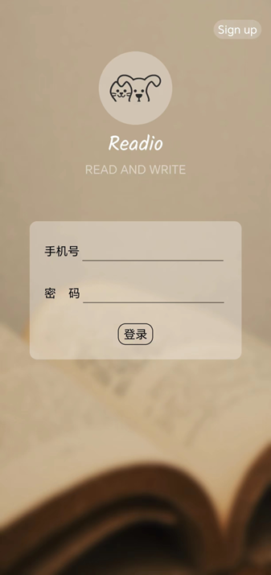
  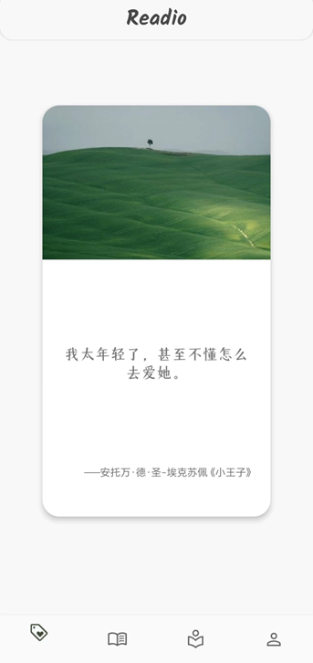
  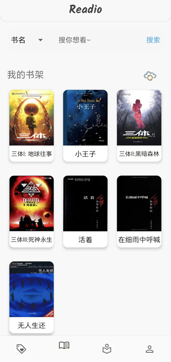
  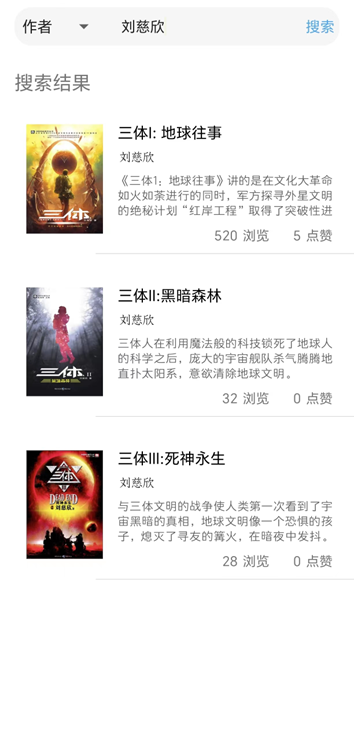
</p>

<p align="center">
  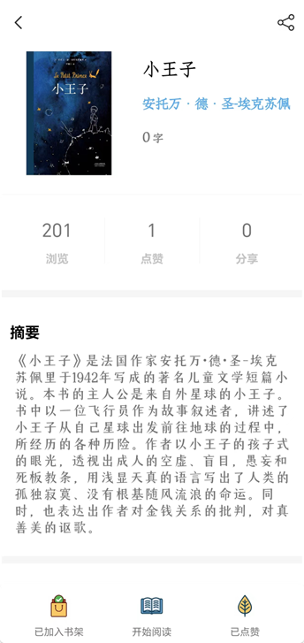
  
  
  
</p>

<p align="center">
  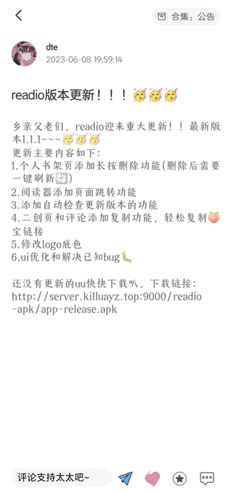
  
  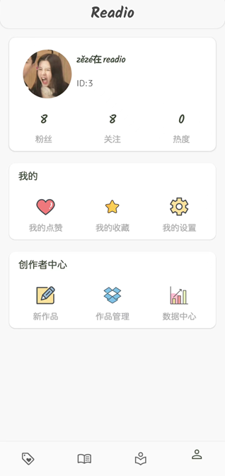
</p>

### 后台管理系统界面

<p align="center">
  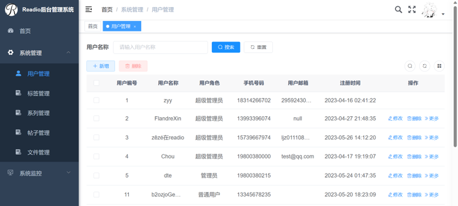
</p>

<p align="center">
  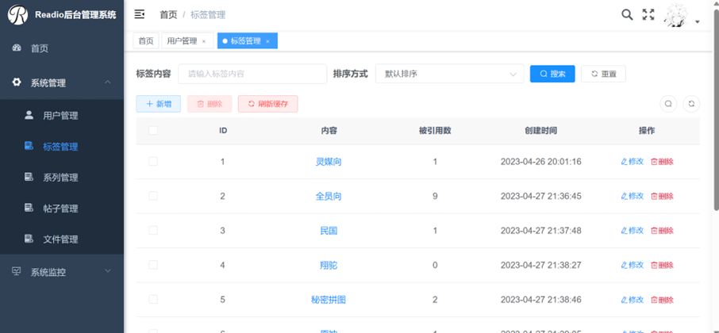
</p>

<p align="center">
  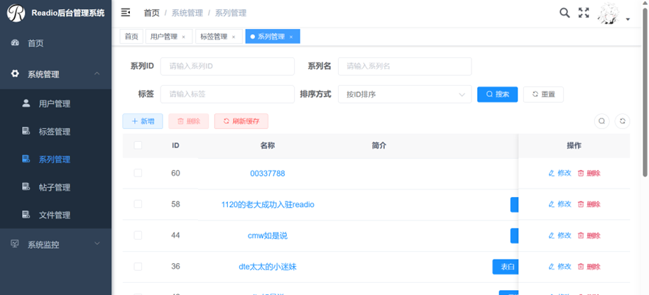
</p>

<p align="center">
  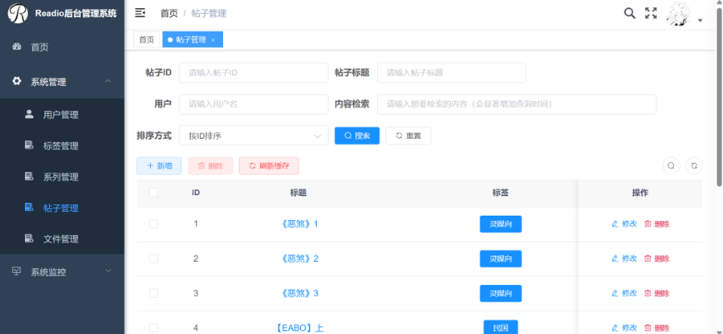
</p>


## 🚀 快速开始

### 环境要求

- **Android 开发**：Android Studio、JDK 16+、Android SDK 24+
- **后端服务**：Python 3.7+、MySQL 5.7+、Redis（可选）
- **后台管理**：Node.js 8.9+、npm 3.0+

### 安装步骤

#### 1. 克隆项目

```bash
git clone <repository-url>
cd ReadIO
```

#### 2. 后端服务

详细说明请参考 [Readio-Server/README.md](Readio-Server/README.md)

```bash
cd Readio-Server
pip install -r requirements.txt
export FLASK_APP=readio
export FLASK_ENV=development
flask run
```

#### 3. 后台管理系统

详细说明请参考 [Readio-Manage/README.md](Readio-Manage/README.md)

```bash
cd Readio-Manage
npm install
npm run dev
```

#### 4. Android 应用

详细说明请参考 [Readio-App/README.md](Readio-App/README.md)

使用 Android Studio 打开 `Readio-App` 目录，配置 Gradle 后即可编译运行。

## ✨ 功能特性

### 移动应用（Android）

- **首页推荐**：好句推荐、好书推荐
- **书架管理**：书籍搜索、阅读进度记录、书籍分类
- **阅读体验**：多格式支持、阅读设置、书签功能
- **二创社区**：作品发布、浏览、点赞、评论
- **个人中心**：用户信息、作品管理、数据统计

### 后台管理系统（Web）

- **用户管理**：用户信息查看、权限管理
- **内容管理**：书籍管理、帖子管理、标签管理
- **文件管理**：电子书文件上传、管理
- **系统监控**：服务器监控、日志查看
- **数据可视化**：数据统计、图表展示

### 后端服务

- **RESTful API**：统一的 API 接口设计
- **用户认证**：JWT Token 认证机制
- **文件处理**：多格式电子书解析与转换
- **缓存机制**：Redis 缓存提升性能
- **定时任务**：自动清理过期 Token 等

## 🛠️ 技术栈

### 前端技术

- **Android App**
  - 语言：Java
  - 框架：MVVM 架构
  - UI：Material Design
  - 网络：OkHttp
  - 数据库：SQLite（本地缓存）

- **后台管理系统**
  - 框架：Vue 2.6
  - UI 组件：Element UI
  - 状态管理：Vuex
  - 路由：Vue Router
  - HTTP 客户端：Axios

### 后端技术

- **框架**：Flask
- **数据库**：MySQL
- **缓存**：Redis（可选）
- **ORM**：SQLAlchemy
- **任务调度**：APScheduler

### 开发工具

- **版本控制**：Git
- **代码托管**：Gitee / CodeArts
- **构建工具**：Gradle（Android）、npm（Web）

## 📚 文档

- [Android App 文档](Readio-App/README.md)
- [后台管理系统文档](Readio-Manage/README.md)
- [后端服务文档](Readio-Server/README.md)

## 🗺️ 系统架构

### 整体架构

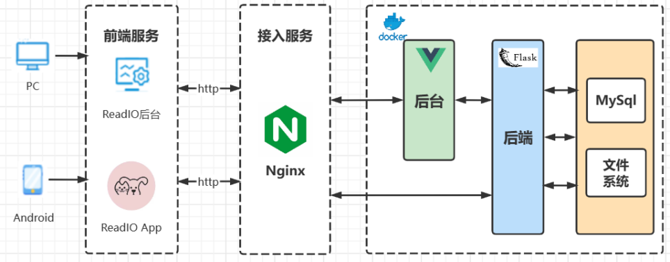

## 🔧 开发指南

### 代码规范

- **Android**：遵循 Android 官方代码规范
- **Python**：遵循 PEP 8 规范
- **JavaScript**：遵循 ESLint 配置规范

### 提交规范

- 使用有意义的提交信息
- 每次提交保持功能完整性
- 提交前进行代码检查

### 测试

- 单元测试：各模块独立测试
- 集成测试：模块间协作测试
- 功能测试：完整功能流程测试

## 📝 版本历史

- **v1.2.3** - 当前版本
  - 完善推荐系统
  - 优化阅读体验
  - 修复已知问题

## 📄 许可证

本项目采用 [MIT 许可证](LICENSE)。

Copyright (c) 2023 ReadIO

详情请参阅 [LICENSE](LICENSE) 文件。

## 🙏 致谢

- 感谢所有为项目做出贡献的开发者
- 感谢使用的开源框架和工具
- 感谢华为云 CodeArts 平台提供的开发支持

## 📮 联系方式

如有问题或建议，请通过以下方式联系：

- 项目仓库：[Github ReadIO](https://github.com/KilluaYZ/ReadIO)
- 问题反馈：[提交 Issue](https://github.com/KilluaYZ/ReadIO/issues)

---

<div align="center">

**ReadIO** - 让阅读更有趣，让分享更简单

Made with ❤️ by ReadIO Team

</div>
